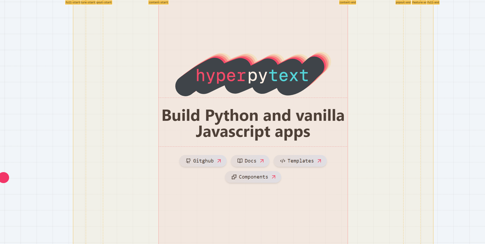

# HyperPyText
#### Build python and vanilla javascript apps :fire: :rocket: :fire:

<br>
<br>


<br>
<br>

HyperPyText is a Python-based tool for creating FastAPI application boilerplates with Tailwind CSS integration. It streamlines the process of setting up a new project by automating the creation of directory structures, configuration files, and initial code templates.

The idea is to set up a dashboard/app project as fast as possible and get working quickly. This boilerplate is a simpler version of [FastHTML](https://fastht.ml/). I just prefer to write the html/css myself.

Its important to note that fastHTML is more robust and complete, this is just a simplified version (no auth, database, ease of deployment tools), so its minimal as of now.

literally built it in a couple of hours with Claude 3.5 Sonnet from [Anthropic](https://www.anthropic.com/).

Ill add more documentation as it improves, this is the first iteration, built in a couple of hours.

Built on top of:

- [FastApi](https://fastapi.tiangolo.com/)
- [Jinja Templates](https://jinja.palletsprojects.com/en/3.1.x/)
- [HTMX](https://htmx.org/)
- [Tailwindcss](https://tailwindcss.com/)

## Features

- FastAPI application setup
- Tailwind CSS integration (npm or standalone)
- Jinja2 templating
- Customizable HTML templates
- Asset management structure
- Environment variable configuration
- Git integration with .gitignore

## Installation

1. Clone the repository:

```bash
git clone https://github.com/yourusername/hyperpytext.git 
```

2. Navigate to the package folder:

```bash
cd hyperpytext
```

3. Install the package using pip:

```bash
pip install .
```

## Usage

After installing the package, run the `create-hyperpy-app {app name}` command to create a new application on the current working directory:

```bash
create-hyperpy-app TestApplication
```

You'll be prompted to enter:

- The HTML file name *(defaults to index.html)*.
- If you want Tailwind css and all its setup options: (npm or standalone installation and [plugins](https://tailwindcss.com/docs/plugins)). 
- If you want to install [Vercel's Geist font](https://vercel.com/font) *(sans and mono versions, using npm)*.

## Project Structure

The generated project will have the following structure:

```
your_app_name/
├── api/
│   ├── routers/
│   │   ├── __init__.py
│   │   └── your_app_name_router.py
│   └── __init__.py
├── assets/
│   ├── css/
│   │   └── input.css
│   ├── docs/
│   ├── fonts/
│   ├── icons/
│   ├── images/
│   ├── js/
│   └── svg-loaders/
├── templates/
│   └── your_html_file.html
├── .env
├── .gitignore
├── app.py
├── install_env.bat
├── README.md
├── requirements.txt
└── tailwind.config.js (if Tailwind CSS is selected)
```

### Tailwind CSS Integration

HyperPyText supports two methods of Tailwind CSS integration:

- NPM: Installs Tailwind CSS via npm and sets up the build process.

- Standalone: Downloads the Tailwind CSS standalone CLI for direct usage.

The setup process creates an `input.css` file and configures the build command to generate the final `style.css` file.

The official plugins that come out of the box with the boilerplate are the [forms](https://github.com/tailwindlabs/tailwindcss-typography), [typography](https://github.com/tailwindlabs/tailwindcss-typography) and [container-queries](https://github.com/tailwindlabs/tailwindcss-container-queries) plugins.

The geist fonts are set as default both for sans and mono families.

### Custom CSS

The `input.css` file includes a content-grid class that allows you to establish a content hiearchy in a straightforward way, mobile friendly as well:



You can determine where an element is placed within the horizonta hierarchy by giving it the utility class that corresponds to each hierarchy breakpoint: 

- `full`
- `feature`
- `popout`
- `content`

The index.html template includes these classes for the `main-content` section, you can also combine them with tailwind's [responsive breakpoints](https://tailwindcss.com/docs/theme): 

```html
<!-- Main content -->
<div id="main-content"
  class="full xl2:feature xl3:popout content-grid h-full xl2:rounded-md xl3:rounded-md">
</div>
```
Inspired by [this blogpost](https://ryanmulligan.dev/blog/layout-breakouts/).

### Customization

You can customize the generated templates by modifying the YAML files in the `templates/` directory of the HyperPyText project.

### Contributing

Contributions are welcome! Please feel free to submit a Pull Request.

### License

This project is licensed under the MIT License.
